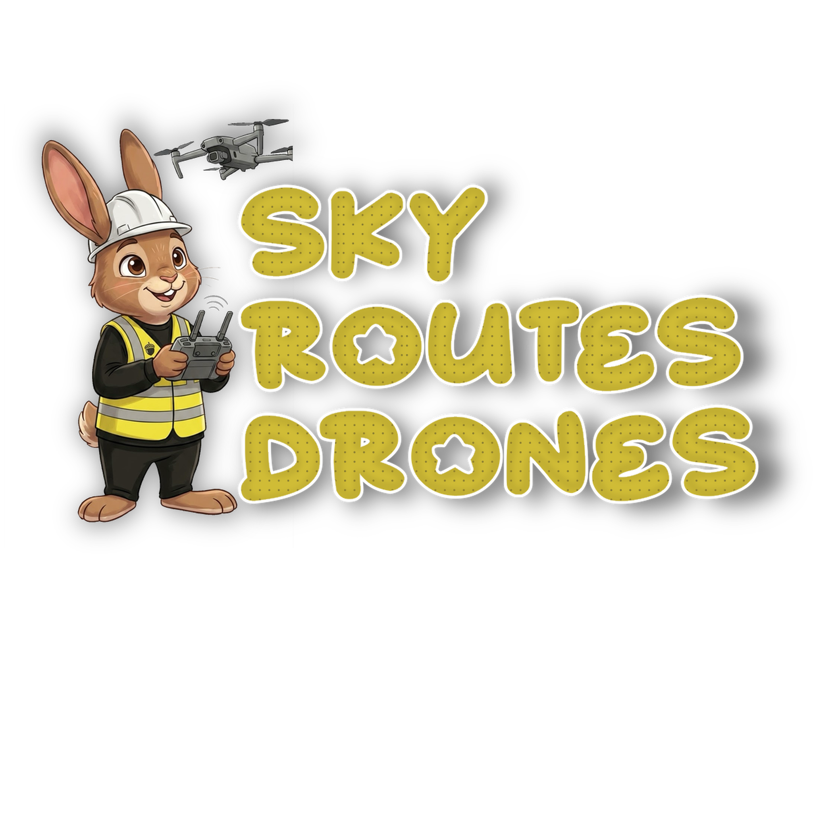

#  SkyRoute: Sistema de Gestión y Telemetría para Drones

[](https://www.python.org/)
[](LICENSE)

---


##  Información Académica y Equipo
* **Institución:** Universidad de Medellín (UDEM)
* **Asignatura:** Algoritmos de Programación Orientada a Objetos
* **Docente:** Mario Alejandro Saldarriaga (Grupo 62)
* **Integrantes:**
  * Alejandro García Jiménez
  * Juan Manuel Pava Higuita
  * Valery Arboleda Ardila

---

##  Estructura del Proyecto

```
SkyRoute-Drones-POO/
├── docs/                             # Documentación formal de análisis (Metodología UDEM)
│   ├── 01_descripcion_del_problema.md# Contexto del problema y planteamiento
│   ├── 02_requisitos_funcionales.md  # Requisitos Funcionales y Reglas de Negocio
│   ├── 03_modelo_del_mundo_uml.md    # Entidades y Diagrama de Clases UML
│   └── ANALISIS_DEL_PROBLEMA.md      # Documento para Entregable # 1
│
├── src/                              # Código fuente del sistema
│   ├── README.md                     # Guía de arquitectura y uso de paquetes
│
├── LICENSE                           # Licencia MIT
└── README.md                         # Este documento
```

---

## 📖 Documentación y Análisis

El análisis formal del problema, los requisitos funcionales, las reglas de negocio y el diagrama de clases UML se encuentran documentados en el directorio [`docs/`](docs/):
* **[01_descripcion_del_problema.md](docs/01_descripcion_del_problema.md):** Planteamiento y contexto de la operación con drones.
* **[02_requisitos_funcionales.md](docs/02_requisitos_funcionales.md):** Requisitos RF-01 a RF-04 y restricciones de dominio.
* **[03_modelo_del_mundo_uml.md](docs/03_modelo_del_mundo_uml.md):** Entidades, asignación de responsabilidades y diagrama UML en Mermaid.
* **[ANALISIS_DEL_PROBLEMA.md](docs/ANALISIS_DEL_PROBLEMA.md):** Documento maestro consolidado para el Entregable 1.