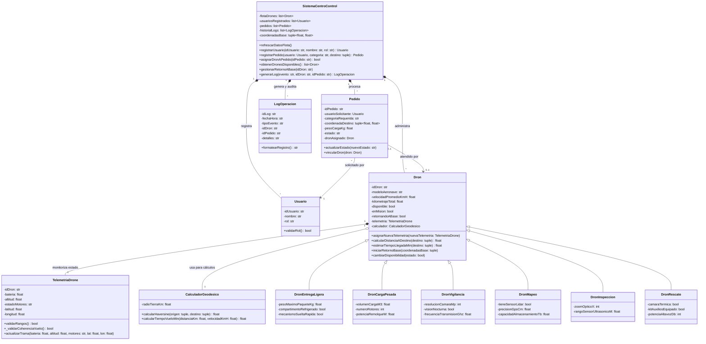

# Documento 03: Modelo del Mundo y Diseño de Clases

**Proyecto:** SkyRoute - Sistema de Gestión y Telemetría para Drones  
**Asignatura:** Algoritmos de Programación Orientada a Objetos  
**Institución:** Universidad de Medellín (UDEM)  

---

## Tabla de Contenidos
- [1. Modelo del Mundo (Conceptualización de Flota)](#1-modelo-del-mundo-conceptualización-de-flota)
  - [1.1 Cuadro Comparativo de Especializaciones](#11-cuadro-comparativo-de-especializaciones)
  - [1.2 Descripción Detallada de los Drones](#12-descripción-detallada-de-los-drones)
- [2. Asignación de Responsabilidades por Entidad del Dominio](#2-asignación-de-responsabilidades-por-entidad-del-dominio)
  - [2.1 Entidades del Núcleo Operativo y Logístico](#21-entidades-del-núcleo-operativo-y-logístico)
  - [2.2 Entidades de Gestión Comercial y Trazabilidad](#22-entidades-de-gestión-comercial-y-trazabilidad)
  - [2.3 Clases de Especialización de Flota](#23-clases-de-especialización-de-flota)
- [3. Modelo de Clases UML (Diagrama Mermaid)](#3-modelo-de-clases-uml-diagrama-mermaid)
  - [3.1 Enlace Drawio](#31-enlace-drawio)
  - [3.2 Especificación Mermaid](#32-especificación-mermaid)

---

## 1. Modelo del Mundo (Conceptualización de Flota)

El sistema **SkyRoute** contempla una arquitectura modular de drones diferenciados por su propósito operativo en entornos urbanos y suburbanos. A continuación, se detallan los 6 tipos de aeronaves no tripuladas que componen la flota:

### 1.1 Cuadro Comparativo de Especializaciones

| # | Tipo de Dron | Categoría Operativa | Caso de Uso Principal | Atributos Específicos UML |
|---|---|---|---|---|
| 1 | **Dron de Entrega Ligera** | Última Milla | Paquetes livianos, medicamentos urgentes, comida en zonas urbanas densas (El Poblado, Laureles). | `pesoMaximoPaqueteKg`, `compartimentoRefrigerado`, `mecanismoSueltaRapida` |
| 2 | **Dron de Carga Pesada** | Transporte Logístico | Mover mercancía industrial o médica entre nodos logísticos (Sabaneta - Bello). | `volumenCargaM3`, `numeroRotores`, `potenciaRemolqueW` |
| 3 | **Dron de Vigilancia** | Monitoreo y Seguridad | Escolta de flota de carga, patrullaje de acopios y verificación pre-aterrizaje. | `resolucionCamaraMp`, `visionNocturna`, `frecuenciaTransmisionGhz` |
| 4 | **Dron de Mapeo** | Cartografía y Topografía | Recopilación geoespacial 3D para cálculo de rutas ortodrómicas en terreno montañoso. | `tieneSensorLidar`, `precisionGpsCm`, `capacidadAlmacenamientoTb` |
| 5 | **Dron de Inspección** | Mantenimiento | Vuelos estacionarios para evaluar infraestructura (vertipuertos, antenas, recarga). | `zoomOpticoX`, `rangoSensorUltrasonicoM` |
| 6 | **Dron de Rescate** | Asistencia de Flota | Respuesta rápida ante descensos forzosos o contingencias (Santa Elena, Nutibara). | `camaraTermica`, `kitAuxiliosEquipado`, `potenciaAltavozDb` |

---

### 1.2 Descripción Detallada de los Drones

#### 1. Dron de Entrega Ligera (Última Milla)
* **Funcionalidad principal:** Está diseñado para el transporte rápido de paquetes pequeños y livianos, como medicamentos urgentes, documentos importantes o comida.
* **Contexto operativo:** Su objetivo es evadir el pesado tráfico vehicular de la ciudad, navegando rápidamente por zonas residenciales o comerciales densas (como El Poblado o Laureles) para entregar el producto directamente al usuario final. Requiere mucha agilidad y sensores de evasión de obstáculos.

#### 2. Dron de Carga Pesada (Transporte Logístico)
* **Funcionalidad principal:** Mover suministros de gran volumen o peso (repuestos, suministros médicos al por mayor, mercancía industrial) entre los diferentes centros de distribución o bodegas de la empresa.
* **Contexto operativo:** En lugar de ir a casas, este dron hace rutas fijas entre puntos logísticos clave (por ejemplo, desde una bodega en el sur en Sabaneta hasta un punto en el norte en Bello). Son más lentos, requieren mucha más batería y vuelan a altitudes más controladas.

#### 3. Dron de Vigilancia y Seguridad (Monitoreo de Rutas)
* **Funcionalidad principal:** Su trabajo no es transportar paquetes, sino escoltar a los drones de carga o patrullar los centros de acopio.
* **Contexto operativo:** Proporciona transmisión de video para asegurar que la mercancía valiosa llegue a su destino sin ser interceptada. También verifica que las zonas de aterrizaje estén despejadas de personas o animales antes de que llegue un dron de entrega.

#### 4. Dron de Mapeo Topográfico
* **Funcionalidad principal:** Recopilar información del terreno y actualizar constantemente los mapas tridimensionales por donde vuela la flota.
* **Contexto operativo:** Debido a la geografía escarpada de las laderas y a la constante construcción de nuevos edificios o instalación de cables, este dron vuela recopilando datos geoespaciales para calcular rutas ortodrómicas seguras y actualizar las bases de datos de altitudes permitidas.

#### 5. Dron de Inspección de Infraestructura
* **Funcionalidad principal:** Revisar el estado técnico de las instalaciones logísticas de la empresa (antenas de comunicación, estaciones de recarga, plataformas de aterrizaje o "vertipuertos").
* **Contexto operativo:** Equipado con cámaras de alta precisión, se encarga de hacer vuelos estacionarios cerca de estructuras clave de la empresa logística para buscar daños, desgaste o fallas, garantizando que el resto de los drones tengan donde aterrizar y comunicarse sin peligro.

#### 6. Dron de Búsqueda y Rescate (Asistencia de Flota)
* **Funcionalidad principal:** Actuar como un equipo de respuesta rápida ante contingencias o emergencias operativas.
* **Contexto operativo:** Si un dron de entrega o carga reporta un error grave (por ejemplo, estado de motores en 'EMERGENCIA' y un descenso forzoso en una zona boscosa o montañosa como Santa Elena o el Cerro Nutibara), este dron se despliega rápidamente a las últimas coordenadas conocidas. Posee cámaras térmicas y de largo alcance para localizar el equipo perdido o la carga.

---

## 2. Asignación de Responsabilidades por Entidad del Dominio

Para que el sistema funcione de manera coordinada y ordenada, cada clase del modelo cumple un rol específico y bien definido. A continuación se desglosa cada entidad del dominio detallando sus **atributos**, **responsabilidades**, **colaboradores**, **requisitos que soporta** e **información que administra**:

---

### 2.1 Entidades del Núcleo Operativo y Logístico

#### 2.1.1 `SistemaCentroControl`
* **Atributos:**
  * `flotaDrones: list[Dron]`: Lista de aeronaves que componen la flota activa.
  * `usuariosRegistrados: list[Usuario]`: Catálogo de usuarios habilitados en la plataforma.
  * `pedidos: list[Pedido]`: Registro general de solicitudes de servicio ingresadas.
  * `historialLogs: list[LogOperacion]`: Bitácora cronológica de eventos y auditoría.
  * `coordenadasBase: tuple[float, float]`: Ubicación geográfica fija de la sede central de operaciones en Medellín.
* **Responsabilidades:**
  * Actuar como la torre de control y centro de comando virtual para toda la operación en el Valle de Aburrá.
  * Dar de alta nuevos usuarios y registrar aeronaves en la flota.
  * Recibir pedidos, cruzando en tiempo real las solicitudes pendientes con los drones disponibles para asignar automáticamente el recurso idóneo según la categoría solicitada.
  * Exigir y coordinar el retorno obligatorio a base una vez concluida una misión, impidiendo que el dron vuelva a estar disponible antes de llegar físicamente a la sede.
  * Generar y almacenar registros de auditoría ante cada evento relevante del sistema.
* **Colaboradores:**
  * `Dron`: Administra la flota, consulta su disponibilidad y activa su retorno a base.
  * `Usuario`: Registra y valida a los usuarios solicitantes.
  * `Pedido`: Centraliza los pedidos y les vincula el dron asignado.
  * `LogOperacion`: Instancia y archiva cada evento del sistema.
* **Requisitos que soporta:**
  * `RF-05` (Actualizar telemetría de flota bajo demanda).
  * `RF-06` (Registrar nuevo usuario en el sistema).
  * `RF-07` (Registrar solicitud de servicio).
  * `RF-08` (Cruzar información y asignar dron).
  * `RF-09` (Gestionar retorno obligatorio a base post-misión).
  * Regla de Negocio 9 (Cruce y consistencia relacional de información).
* **Información que administra:**
  * El inventario global de la flota, el registro de clientes y operadores, el estado de todos los pedidos y la memoria histórica de eventos operacionales.

---

#### 2.1.2 `Dron`
* **Atributos:**
  * `idDron: str`: Identificador alfanumérico único de la aeronave.
  * `modeloAeronave: str`: Referencia técnica o comercial del modelo.
  * `velocidadPromedioKmH: float`: Velocidad de crucero para traslados en km/h.
  * `kilometrajeTotal: float`: Odómetro de vuelo acumulado a lo largo de sus misiones.
  * `disponible: bool`: Bandera lógica que indica si está libre para recibir un nuevo encargo.
  * `enMision: bool`: Bandera que señala si se encuentra en vuelo realizando un servicio.
  * `retornandoABase: bool`: Bandera que indica si está en tránsito de regreso a la sede central.
  * `telemetria: TelemetriaDrone`: Instancia con los datos sensoriales en tiempo real.
  * `calculador: CalculadorGeodesico`: Herramienta matemática asociada para cálculos de navegación.
* **Responsabilidades:**
  * Modelar el comportamiento y el estado físico-operativo de cada aeronave de la empresa.
  * Vincular y actualizar su estado sensorial mediante su objeto de telemetría.
  * Calcular distancias hacia destinos geográficos y proyectar el tiempo estimado de llegada (ETA) en minutos delegando en su calculador.
  * Controlar su propio ciclo de misión, pasando de disponible a ocupado, y luego a estado de retorno obligatorio a base.
  * Proporcionar formatos de texto legibles para operadores (`__str__`) y fichas técnicas de inspección para desarrolladores (`__repr__`).
* **Colaboradores:**
  * `TelemetriaDrone`: Contiene sus mediciones físicas de batería, altitud, coordenadas y motores.
  * `CalculadorGeodesico`: Realiza los cálculos trigonométricos de distancia y tiempo.
  * `Pedido`: Aeronave asignada para ejecutar la orden de servicio.
  * `SistemaCentroControl`: Responde a las órdenes de asignación y retorno.
* **Requisitos que soporta:**
  * `RF-03` (Calcular distancia ortodrómica a destino).
  * `RF-04` (Consultar formato de consola e inspección técnica).
  * `RF-05` (Actualizar telemetría de flota).
  * `RF-09` (Gestionar retorno obligatorio a base).
  * `RF-10` (Calcular tiempo estimado de vuelo - ETA).
  * Regla de Negocio 1 (Identificador único no vacío).
* **Información que administra:**
  * Su ficha técnica de identificación, odómetro acumulado, estados operacionales (disponible, misión, retorno), lectura sensorial actual y herramienta de navegación.

---

#### 2.1.3 `TelemetriaDrone`
* **Atributos:**
  * `idDron: str`: Identificador del dron al que pertenecen las lecturas.
  * `bateria: float`: Porcentaje de carga restante de la batería (`[0.0, 100.0]%`).
  * `altitud: float`: Altura de vuelo sobre el nivel del suelo en metros (`[0.0, 120.0] m`).
  * `estadoMotores: str`: Estado de la planta motriz (`'APAGADOS'`, `'STANDBY'`, `'EN_VUELO'`, `'EMERGENCIA'`).
  * `latitud: float`: Coordenada de latitud en grados decimales (`[-90.0, 90.0]`).
  * `longitud: float`: Coordenada de longitud en grados decimales (`[-180.0, 180.0]`).
* **Responsabilidades:**
  * Empaquetar y custodiar los datos sensoriales transmitidos por la aeronave en cada instante.
  * Validar estrictamente las reglas de dominio físico y regulatorio antes de aceptar cualquier valor.
  * Verificar la coherencia física entre altitud y motores (motores obligatoriamente `'EN_VUELO'` si `altitud > 0.0 m`; prohibido `'EN_VUELO'` si `altitud == 0.0 m`).
  * Disparar excepciones de dominio específicas (`BateriaInvalidaError`, `AltitudInvalidaError`, etc.) cuando se detecte una anomalía.
  * Permitir la actualización de la trama de datos bajo demanda del operador.
* **Colaboradores:**
  * `Dron`: Le provee su información sensorial y de ubicación en todo momento.
  * Excepciones de dominio: Dispara las clases de error correspondientes ante fallas de validación.
* **Requisitos que soporta:**
  * `RF-01` (Validar e instanciar trama de telemetría).
  * `RF-02` (Notificar excepciones de dominio específicas).
  * `RF-05` (Actualizar telemetría de la flota bajo demanda).
  * Reglas de Negocio 2, 3, 4 y 5.
* **Información que administra:**
  * Mediciones físicas y espaciales del dron: energía restante, cota altimétrica, condición motriz y posicionamiento global por GPS.

---

#### 2.1.4 `CalculadorGeodesico`
* **Atributos:**
  * `radioTierraKm: float`: Constante que define el radio medio terrestre (fijada en `6371.0 km`).
* **Responsabilidades:**
  * Realizar cálculos de trigonometría esférica para determinar la distancia ortodrómica en kilómetros entre dos coordenadas geográficas mediante la fórmula de Haversine.
  * Calcular el tiempo estimado de viaje (ETA) en minutos relacionando la distancia calculada con la velocidad promedio de vuelo.
* **Colaboradores:**
  * `Dron`: Utiliza sus métodos para conocer distancias a destinos y a la base central.
* **Requisitos que soporta:**
  * `RF-03` (Calcular distancia ortodrómica a destino).
  * `RF-10` (Calcular tiempo estimado de vuelo - ETA).
  * Regla de Negocio 6 (Cálculo geodésico Haversine).
* **Información que administra:**
  * Parámetros matemáticos y constante del radio de la Tierra.

---

### 2.2 Entidades de Gestión Comercial y Trazabilidad

#### 2.2.1 `Usuario`
* **Atributos:**
  * `idUsuario: str`: Identificador alfanumérico único de la persona o entidad.
  * `nombre: str`: Nombre completo o razón social del usuario registrado.
  * `rol: str`: Nivel de permisos dentro de la plataforma (`'CLIENTE'`, `'OPERADOR_VUELO'`, `'ADMINISTRADOR'`).
* **Responsabilidades:**
  * Identificar formalmente a los actores que interactúan con el sistema SkyRoute.
  * Validar que el identificador no sea vacío y que el rol asignado sea válido dentro de las políticas de la empresa.
* **Colaboradores:**
  * `SistemaCentroControl`: Registra y custodia a los usuarios autorizados.
  * `Pedido`: Aparece vinculado como el usuario solicitante de la orden de servicio.
* **Requisitos que soporta:**
  * `RF-06` (Registrar nuevo usuario en el sistema).
  * Regla de Negocio 7 (Validación de usuario y roles).
* **Información que administra:**
  * Identificador, nombre de usuario y perfil de privilegios en el sistema.

---

#### 2.2.2 `Pedido`
* **Atributos:**
  * `idPedido: str`: Código alfanumérico único de la solicitud de servicio.
  * `usuarioSolicitante: Usuario`: Instancia del usuario que solicita la misión.
  * `categoriaRequerida: str`: Categoría del dron requerido (ej. `'ENTREGA_LIGERA'`, `'CARGA_PESADA'`, etc.).
  * `coordenadaDestino: tuple[float, float]`: Coordenadas `(latitud, longitud)` donde se debe ejecutar la entrega o servicio.
  * `pesoCargaKg: float`: Masa de la mercancía en kilogramos (cuando la misión involucra transporte físico).
  * `estado: str`: Estado del ciclo de vida del pedido (`'PENDIENTE'`, `'ASIGNADO'`, `'EN_TRANSITO'`, `'COMPLETADO'`, `'CANCELADO'`).
  * `dronAsignado: Dron`: Referencia a la aeronave vinculada para cumplir la misión.
* **Responsabilidades:**
  * Modelar y estructurar el encargo de servicio solicitado por un cliente u operador.
  * Custodiar los requerimientos específicos de la misión (coordenadas objetivo, peso a transportar y categoría necesaria).
  * Administrar la transición de sus estados operativos a medida que avanza el servicio.
  * Enlazar formalmente la aeronave física asignada por el centro de control.
* **Colaboradores:**
  * `Usuario`: Usuario que solicita la orden.
  * `Dron`: Aeronave asignada para ejecutar la misión.
  * `SistemaCentroControl`: Orquesta la creación y asignación del pedido.
* **Requisitos que soporta:**
  * `RF-07` (Registrar solicitud de servicio).
  * `RF-08` (Cruzar información y asignar dron).
  * Regla de Negocio 8 (Validación y consistencia de pedido).
* **Información que administra:**
  * Identificador del encargo, cliente solicitante, especificaciones de la misión (categoría, destino, peso), estado del pedido y dron adjudicado.

---

#### 2.2.3 `LogOperacion`
* **Atributos:**
  * `idLog: str`: Código único del registro de auditoría.
  * `fechaHora: str`: Marca temporal con fecha y hora exacta del evento.
  * `tipoEvento: str`: Categoría o nombre del acontecimiento (ej. `'CREACION_PEDIDO'`, `'ASIGNACION_DRON'`, `'INICIO_RETORNO'`).
  * `idDron: str`: Identificador del dron involucrado en el suceso (si aplica).
  * `idPedido: str`: Identificador del pedido relacionado (si aplica).
  * `detalles: str`: Texto explicativo con detalles operacionales del evento.
* **Responsabilidades:**
  * Preservar la trazabilidad histórica de todas las acciones y decisiones tomadas en el sistema.
  * Garantizar la inmutabilidad de los registros operacionales.
  * Formatear líneas de auditoría estandarizadas para inspección y reportes en consola.
* **Colaboradores:**
  * `SistemaCentroControl`: Encargado de instanciar y recopilar cada log.
* **Requisitos que soporta:**
  * Trazabilidad transversal y auditoría de `RF-06`, `RF-07`, `RF-08` y `RF-09`.
* **Información que administra:**
  * Registro de auditoría con sello de tiempo, clasificación de evento, entidades asociadas y descripción técnica.

---

### 2.3 Clases de Especialización de Flota (Subtipos de Drones)

#### 2.3.1 `DronEntregaLigera` (Última Milla)
* **Atributos:**
  * `pesoMaximoPaqueteKg: float`: Capacidad máxima de carga en kilogramos.
  * `compartimentoRefrigerado: bool`: Indicador de compartimento térmico para medicamentos/comida.
  * `mecanismoSueltaRapida: bool`: Indicador de gancho o escotilla de liberación automática.
* **Responsabilidades:**
  * Gestionar la entrega ágil de paquetes pequeños en zonas urbanas densas, controlando límites de peso liviano y operando mecanismos de descarga rápida o aislamiento térmico.
* **Colaboradores:**
  * Especializa a la clase `Dron` (hereda todos sus atributos y métodos generales).
* **Requisitos que soporta:** `RF-07`, `RF-08`.
* **Información que administra:** Límite de carga en kg, habilitación de refrigeración y estado del mecanismo de suelta.

---

#### 2.3.2 `DronCargaPesada` (Transporte Logístico)
* **Atributos:**
  * `volumenCargaM3: float`: Capacidad volumétrica cúbica de la bodega interna.
  * `numeroRotores: int`: Cantidad de rotores dedicados a sustentación y empuje.
  * `potenciaRemolqueW: float`: Potencia en vatios de arrastre industrial.
* **Responsabilidades:**
  * Administrar traslados de gran volumen o suministros al por mayor entre bodegas logísticas, gestionando la tracción de múltiples rotores y la potencia de arrastre.
* **Colaboradores:**
  * Especializa a la clase `Dron`.
* **Requisitos que soporta:** `RF-07`, `RF-08`.
* **Información que administra:** Capacidad volumétrica en metros cúbicos, número de rotores instalados y potencia de empuje en vatios.

---

#### 2.3.3 `DronVigilancia` (Seguridad y Monitoreo)
* **Atributos:**
  * `resolucionCamaraMp: int`: Resolución del sensor óptico principal en megapíxeles.
  * `visionNocturna: bool`: Indicador de visión infrarroja nocturna.
  * `frecuenciaTransmisionGhz: float`: Frecuencia en GHz para el enlace de video en vivo.
* **Responsabilidades:**
  * Escolta aérea de drones de carga, patrullaje de perímetros de vertipuertos y transmisión de video de alta definición tanto diurna como nocturna.
* **Colaboradores:**
  * Especializa a la clase `Dron`.
* **Requisitos que soporta:** `RF-07`, `RF-08`.
* **Información que administra:** Megapíxeles de cámara, disponibilidad de visión nocturna y frecuencia en GHz del canal de transmisión.

---

#### 2.3.4 `DronMapeo` (Cartografía y Topografía)
* **Atributos:**
  * `tieneSensorLidar: bool`: Indicador de escáner láser de teledetección óptica.
  * `precisionGpsCm: float`: Margen de precisión del posicionamiento satelital en centímetros.
  * `capacidadAlmacenamientoTb: float`: Capacidad del disco de almacenamiento de nubes de puntos 3D.
* **Responsabilidades:**
  * Recopilar datos geoespaciales 3D mediante pulsos láser LiDAR y GPS de alta precisión en laderas y zonas montañosas para mantener actualizadas las rutas de vuelo seguras.
* **Colaboradores:**
  * Especializa a la clase `Dron`.
* **Requisitos que soporta:** `RF-07`, `RF-08`.
* **Información que administra:** Estado de sensor LiDAR, margen de error del GPS en centímetros y espacio de almacenamiento para escaneos 3D.

---

#### 2.3.5 `DronInspeccion` (Mantenimiento de Infraestructura)
* **Atributos:**
  * `zoomOpticoX: int`: Factor de aumentos del zoom óptico mecánico.
  * `rangoSensorUltrasonicoM: float`: Rango máximo en metros del sensor de proximidad.
* **Responsabilidades:**
  * Realizar vuelo estacionario cercano para inspeccionar fisuras, desgastes o averías técnicas en antenas, vertipuertos y estaciones de recarga sin riesgo de colisión.
* **Colaboradores:**
  * Especializa a la clase `Dron`.
* **Requisitos que soporta:** `RF-07`, `RF-08`.
* **Información que administra:** Factor de zoom óptico y distancia mínima de seguridad de sensores ultrasónicos.

---

#### 2.3.6 `DronRescate` (Asistencia y Búsqueda Operativa)
* **Atributos:**
  * `camaraTermica: bool`: Indicador de sensor térmico FLIR para detección por calor.
  * `kitAuxiliosEquipado: bool`: Indicador de botiquín o kit de herramientas de emergencia.
  * `potenciaAltavozDb: int`: Nivel de presión sonora del megáfono/altavoz en decibelios.
* **Responsabilidades:**
  * Responder con inmediatez ante descensos forzosos de aeronaves de la flota en zonas de difícil acceso, localizándolas mediante calor, emitiendo mensajes acústicos y transportando suministros de rescate.
* **Colaboradores:**
  * Especializa a la clase `Dron`.
* **Requisitos que soporta:** `RF-07`, `RF-08`.
* **Información que administra:** Disponibilidad de sensor térmico, presencia de botiquín/kit de auxilio y potencia sonora del altavoz en decibelios.

---

## 3. Modelo de Clases UML (Diagrama Mermaid)

### 3.1 Enlace Drawio

> **Diagrama en Draw.io:**  
https://drive.google.com/file/d/1L1QFliRs5vp0Q_SnUW9ahnXzg7J49c-M/view?usp=sharing

### 3.2 Especificación Mermaid

